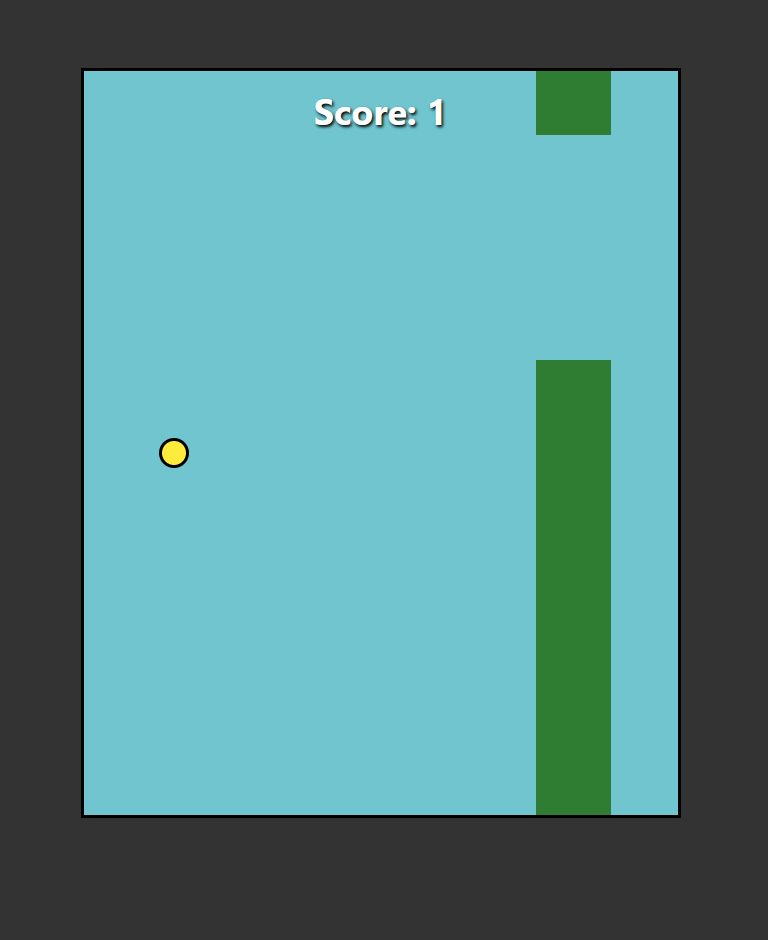

# 🐦 Flappy Bird Clone (Vanilla JS)

  

A lightweight, single-file recreation of the classic **Flappy Bird** game built entirely with standard HTML, CSS, and Vanilla JavaScript. This project demonstrates DOM manipulation, game loops, and collision detection without using any external game libraries.

---

## 📸 Screenshots



---

## 🎮 Features

* **Core Mechanics:** Gravity simulation, jumping logic, and infinite scrolling background.
* **Dynamic Obstacles:** Pipes generate at random heights using JavaScript math functions (`Math.random()`).
* **Collision Detection:** Custom algorithm to detect hits between the bird and pipes or the ground.
* **Score Tracking:** Real-time score updates as the player successfully passes obstacles.
* **Game Over Menu:** A custom UI overlay that allows the user to **Restart** immediately or **Exit** the game.
* **Browser Safety:** Includes a smart fallback for the "Exit" button (since modern browsers restrict scripts from closing tabs).

## 🕹️ How to Play

1.  **Start:** Open the file in a browser to begin.
2.  **Controls:** Press **Spacebar** or **Left Click** to jump.
3.  **Objective:** Navigate through the gaps in the green pipes.
4.  **Game Over:** If you hit a pipe or the ground, the game ends and the score menu appears.

## 🚀 Installation & Usage

Since this is a static site, no installation of dependencies is required.

1.  **Clone the repository:**
    ```bash
    git clone [https://github.com/your-username/flappy-bird-js.git](https://github.com/your-username/flappy-bird-js.git)
    ```
2.  **Navigate to the folder:**
    ```bash
    cd flappy-bird-js
    ```
3.  **Run the Game:**
    Double-click `index.html` (or `game.html`) to open it in your default web browser.

## 🧠 Code Logic Highlights

### The Game Loop
The game runs on a 10ms interval to constantly update the bird's position and check for collisions.

```javascript
setInterval(function(){
    var birdTop = parseInt(window.getComputedStyle(bird).getPropertyValue("top"));
    
    // Gravity: pulls bird down if not jumping
    if(jumping == 0){
        bird.style.top = (birdTop + 3) + "px";
    }
    
    // Collision Logic...
}, 10);
